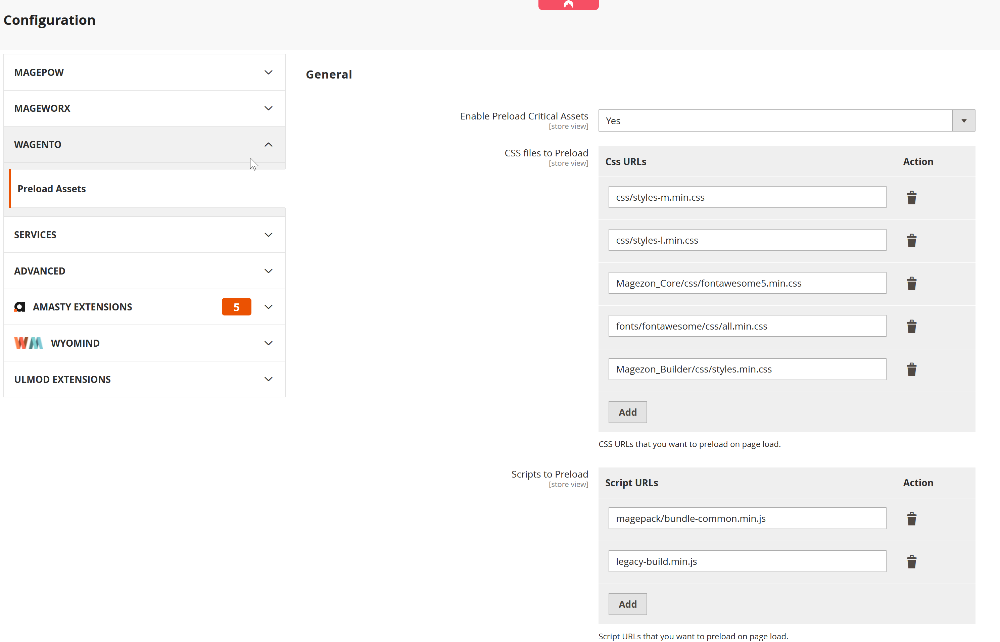

# Assets preload

This module improves Frontend performance by adding critical assets to the preload tag in html `<head>` tag
To get the list of file for preloading , use google lighthouse to measure and get the list of suggested files

# Installation
Download zip file of this module and extract to this directory `app/code/Wage`
Enable module with
```
php bin/magento module:enable Wage_Preload
php bin/magento cache:flush
```

you can configure preload assets like below

